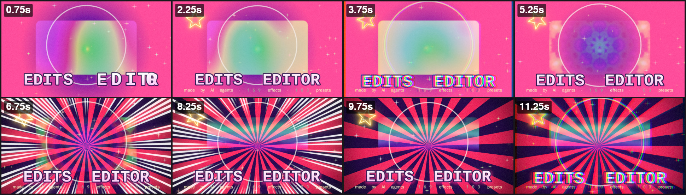
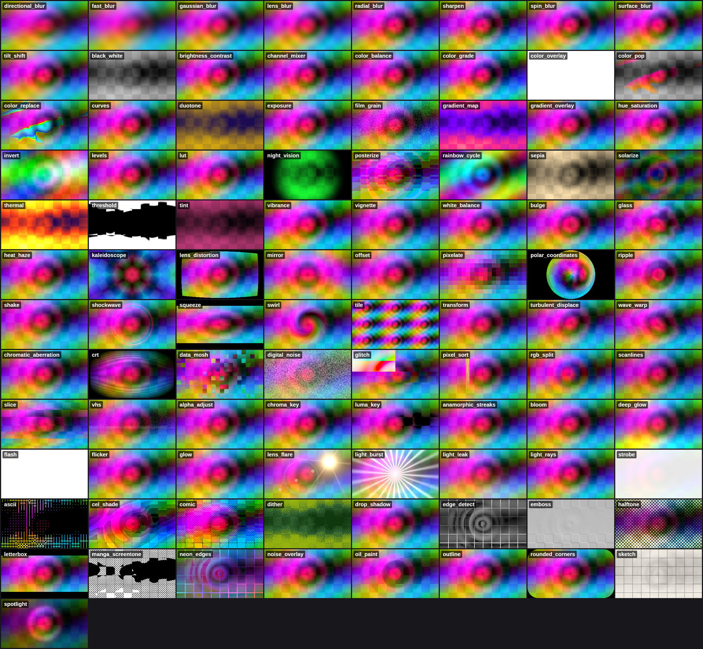
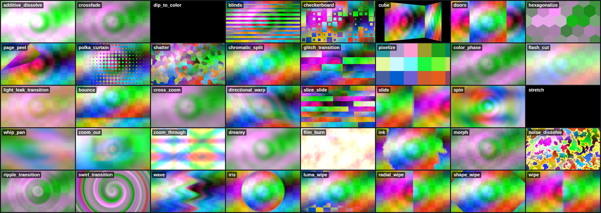
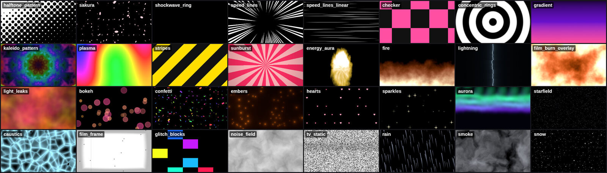

# EditsEditor

**A native, GPU-accelerated video editor built for AI agents.** Agents create anime edits, AMVs, lyric videos,
motion graphics and beat-synced montages by driving it over **MCP**, a scriptable **CLI**, or plain
**JSON project files**. A live **viewer** shows the result as they work.



*The sheet above comes from [`examples/showcase.rhai`](examples/showcase.rhai). It uses only generators, shapes and text, with no footage.*

- **169 GPU effects**: 97 filters, 40 transitions and 32 generators, all written in WGSL. They cover glow, bloom, glitch, RGB split, datamosh, shake, zoom blur, speed lines, halftone, manga, VHS, chromatic aberration, keying, LUTs and more.
- **103 presets**: Rhai scripts that build effect stacks, keyframes and expressions. They include impacts, beat-synced motion, looks, text animations, audio-reactive effects and timeline-wide automation such as `auto_amv`, `beat_cut_montage` and `lyrics_from_subtitles`.
- **Music intelligence**: tempo, beats, downbeats, drops, sections and band envelopes. Beat-synced expressions such as `pulse()`, `bass()` and `wiggle()` work on every property.
- **Total control**: every property can be static, keyframed with 40+ easings, or driven by a per-frame expression. An agent can edit a preset by its properties, by its script, or write a new effect or preset at runtime.
- **Many input types**: video, images, image sequences, GIF, audio, SVG, subtitles (SRT/VTT/ASS/LRC), `.cube` LUTs, fonts, text, vector shapes and procedural generators.
- **Many output types**: H.264, H.265, AV1, ProRes (including 4444 with alpha), VP9, GIF, WebP, APNG and PNG sequences. NVENC, AMF and QSV are probed and used automatically when available.

| Filters | Transitions | Generators |
|---|---|---|
|  |  |  |

---

## Install (Windows 10/11)

1. Get **FFmpeg**: `winget install Gyan.FFmpeg`. Scoop or Chocolatey also work, or put `ffmpeg.exe` on `PATH` or next to `edits.exe`.
2. Download `edits.exe` and `edits-viewer.exe` from the [Releases](../../releases) page or a CI artifact. To build from source instead:

   ```powershell
   # Rust 1.90+
   cargo build --release -p edits-cli -p edits-viewer
   # -> target\release\edits.exe, target\release\edits-viewer.exe
   ```
3. Check the setup:

   ```powershell
   edits doctor
   ```

   This reports FFmpeg, hardware encoders, the GPU adapter (D3D12/Vulkan, with WARP as the fallback via `--software-gpu`), fonts, and the library size.

## Connect an agent (MCP)

```powershell
# Claude Code
claude mcp add edits-editor -- C:\path\to\edits.exe mcp

# Any other MCP client: print a ready-made config block
edits mcp-config
```

```json
{ "mcpServers": { "edits-editor": { "command": "C:\\path\\to\\edits.exe", "args": ["mcp"] } } }
```

The server speaks MCP over stdio and exposes **38 tools**:

| Area | Tools |
|---|---|
| Project | `project_open` `project_summary` `project_get` `project_patch` `set` `keyframes` `history` `validate` `status` `schema` |
| Media | `media_import` `media_info` `analyze_audio` `detect_scenes` `media_preview` `waveform` `fonts_list` |
| Timeline | `track_add` `clip_add` `clip_update` `clip_op` (split/move/duplicate/ripple…) `remove` |
| Effects | `effect_add` `effects_list` `effect_info` `effect_preview` `effect_create` |
| Presets & code | `presets_list` `preset_info` `preset_apply` `preset_create` `script_run` `expression_test` |
| Output | `render_frame` `render_frames` `render_preview` `export` |
| Help | `reference` (workflow, format, expressions, scripting, effects, presets, easings, blend modes, tips) |

Agents check their work visually. `render_frame`, `render_frames` (a contact sheet), `effect_preview` and `media_preview` return images inline, so the agent sees the frame it made.

## Quick start (CLI)

```powershell
edits new my.edits.json --width 1920 --height 1080 --fps 24 --duration 60
edits import my.edits.json D:\clips\*.mp4 D:\music\song.flac
edits analyze my.edits.json song            # beats, downbeats, drops, sections -> project timing
edits preset my.edits.json auto_amv --args '{"music":"song","title":"MY EDIT"}'
edits view my.edits.json                    # live viewer; reloads whenever the file changes
edits sheet my.edits.json -o sheet.jpg      # contact sheet for a quick review
edits render my.edits.json -o out.mp4 --codec h264 --quality 90
```

Other commands: `scenes`, `summary`, `validate`, `frame`, `script`, `effects`, `presets`, `doc`, `schema`, `catalog`, `gallery`. Run `edits help <cmd>` for details.

## How agents control it

### 1. Properties: a static value, keyframes, or an expression

Every numeric, vector or color property accepts any of these forms:

```jsonc
"opacity": 0.8
"scale":   { "keyframes": [[0, [1.4, 1.4], "punch"], [0.4, [1, 1]]] }
"rotation":{ "expr": "wiggle(4, 3) + pulse(10) * 8" }      // per frame, beat-aware
"position":{ "keyframes": [[0, [-1400, 0], "whip"], [0.3, [0, 0]]], "loop": "ping_pong" }
```

Expressions are Rhai and evaluate every frame. Among other things they can read time and beat state (`t`, `beat`, `bar`, `beat_phase`), use
`pulse()`, `downbeat_pulse()`, `drop_pulse()`, `in_drop()` and `since_drop()`, read live audio bands (`bass()`, `low_mid()`, `high_mid()`,
`treble()`, `level()`, `onset()`), and call `noise()`, `fbm()`, `wiggle()`, `jitter()`, `ease()`, `tween()` and `remap()`, plus vector math. See [docs/expressions.md](docs/expressions.md).

### 2. Effects: pick, tweak, stack, or write new ones

```jsonc
"effects": [
  { "effect": "rgb_split", "params": { "amount": { "expr": "pulse(12) * 24" } } },
  { "effect": "glow", "params": { "threshold": 0.6, "intensity": 1.4 }, "mix": 0.8 }
]
```

New effects are WGSL files with a TOML header. Agents can create them at runtime with `effect_create`. The header generates the parameter UI, schema and uniforms. Errors are reported with line numbers that match the file, and effects can be multi-pass.

```wgsl
//! id = "my_scanlines"
//! kind = "filter"
//! params = [ { name = "density", type = "float", default = 400.0, min = 10.0, max = 2000.0 } ]
fn effect(uv: vec2f, p: Params) -> vec4f {
    let c = src(uv);
    return vec4f(c.rgb * (0.75 + 0.25 * sin(uv.y * p.density)), c.a);
}
```

See [docs/effect-authoring.md](docs/effect-authoring.md) and the full catalog in [docs/effects.md](docs/effects.md).

### 3. Presets and scripts: macros written in code

Presets are Rhai scripts with typed arguments. Agents can apply them, read their source, fork them with
`preset_create`, or run arbitrary scripts against the project:

```rust
// Cut the footage on every 2nd beat, punch-zoom each cut, flash on drops.
let shots = project.assets("video");
let end_t = project.comp().duration;
let cuts = every(beats_between(0.0, end_t), 2);
cuts.push(end_t);
let track = project.add_track("cuts");
for i in 0..cuts.len() - 1 {
    let c = project.add_clip(track, #{ source: #{ type: "media", asset: shots[i % shots.len()] }, start: cuts[i], duration: cuts[i + 1] - cuts[i] });
    project.apply_preset(c, "zoom_punch", #{});
}
project.apply_preset("", "flash_on_drops", #{});
```

See [docs/scripting.md](docs/scripting.md) and [docs/presets.md](docs/presets.md).

### 4. The project file

A project is plain JSON (`*.edits.json`) with a published [JSON Schema](docs/project.schema.json). It contains
compositions (nestable), tracks, clips (media, text, shape, generator, nested comp, adjustment, solid), a 2.5D
transform with motion blur, 29 blend modes, SDF masks, track mattes, echo/trails, time remapping and reversal,
transitions, per-clip audio with effects, and project timing. Any edit an agent makes is visible in the viewer and
undoable. See [docs/format.md](docs/format.md) and [docs/agent-guide.md](docs/agent-guide.md).

## Architecture

```
crates/
  edits-core     data model, Property<T> (static | keyframes | expr), 40+ easings, ops, undo/redo, validation, schema
  edits-fx       effect + preset library: WGSL/Rhai with TOML headers, embedded at build time, naga-validated, LUT parser
  edits-media    FFmpeg via pipes: probing, prefetching decoder with LRU + seek heuristics, HW encoders, subtitles, scenes
  edits-audio    STFT analysis, onset/tempo/DP beat tracking, drops, sections, envelopes; mixer with limiter; waveforms
  edits-render   wgpu compositor: linear-light fp16 premultiplied pipeline, pooled textures, async readback, text, shapes
  edits-engine   evaluation (nested comps, transitions, mattes, adjustments), Rhai expressions & scripting, export
  edits-mcp      rmcp stdio server: 38 tools + reference docs
  edits-cli      `edits.exe`
  edits-viewer   `edits-viewer.exe`: egui/eframe on the same wgpu device (zero-copy), timeline, inspector, WASAPI audio
```

**Why Rust:** native speed with no GC pauses during export, a first-class modern GPU API (wgpu on D3D12 and Vulkan),
and a single self-contained `.exe`. FFmpeg runs out of process, so licensing and DLL problems stay out of the binary.

### Performance techniques

- **Linear-light fp16 working space.** Blends, blurs and glows are physically correct and don't band. sRGB conversion happens in hardware on upload and output.
- **One shared bind group layout for every effect.** Pipelines are compiled once and cached, and uniforms go through a single ring buffer per frame.
- **Texture pool.** Intermediate targets are recycled by size and format, so a steady frame allocates nothing.
- **Pipelined export.** The GPU renders frame N+1 while frame N reads back asynchronously and a separate thread feeds the FFmpeg encoder.
- **Decoder prefetch.** Each source runs a background reader with an LRU frame cache. Forward scrubbing reuses the stream, and a seek only happens when a jump goes past a threshold.
- **Cached static layers.** Text, shapes and stills are rasterized once and keyed by content hash.
- **Compiled Rhai.** Expressions are compiled ASTs, cached per expression string and evaluated with a reused scope.
- **Zero-copy viewer.** The viewer renders straight into an egui-registered texture on the shared device.
- **Release profile.** Thin LTO with `codegen-units = 1`.

## Development

```powershell
cargo test --workspace     # core, fx (validates all 169 shaders), media, audio, GPU (runs every effect), engine e2e, all presets
edits catalog -o docs      # regenerate docs/effects.md + docs/presets.md
edits gallery -o docs/images
```

The GPU tests use the system adapter and fall back to software (WARP or lavapipe). Media tests need FFmpeg on `PATH`.

## License

MIT
